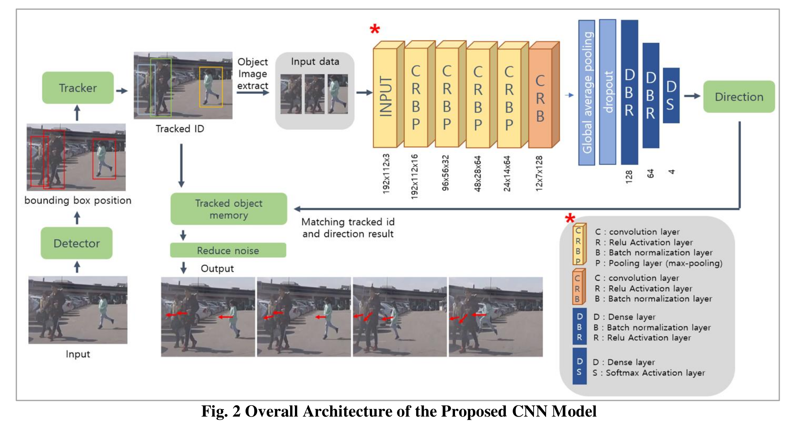

# Fast motion Recognition of Pedestrians using 2D CNN

## Process

## Run video
> python object_tracker.py --video ./data/video/test.mp4 --output ./outputs/demo.avi --model yolov4

## Run webcam (set video flag to 0)
> python object_tracker.py --video 0 --output ./outputs/webcam.avi --model yolov4

## Reference and backbone
> yolov4-DeepSORT (https://github.com/theAIGuysCode/yolov4-deepsort)

## Author
[taem98](https://github.com/taem98)